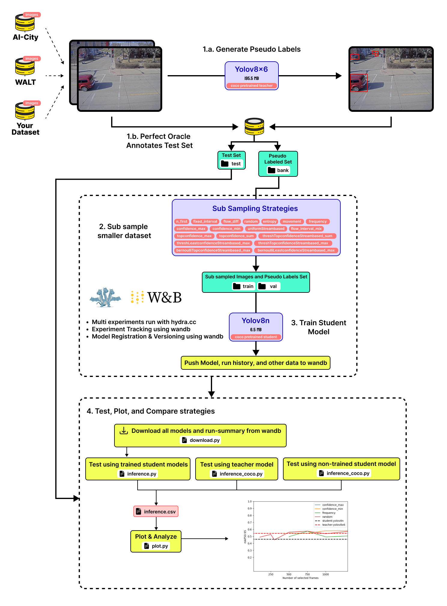
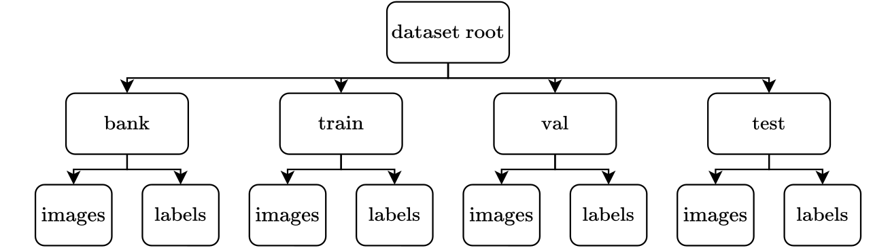

# Stream-Based Active Distillation for Scalable Model Deployment

[[paper]](link)[[test_set_WALT_cam1]](https://universe.roboflow.com/sbad/walt_cam1_test_set) [[test_set_WALT_cam2]](https://universe.roboflow.com/sbad/walt_cam2_test_set)



## Table of Contents
1. [Installation](#installation)
2. [Datasets](#datasets)
3. [Getting Started](#getting-started)
4. [Testing](#testing)

---

## 1. [Installation](#installation)

The code was developed using Linux 20.04. 

### Setup your virtual environment 

We recommend working in a virtualenv or conda environment.

```bash
conda create -y --name SBAD python pip
conda activate SBAD
```
### Requirements

To reproduce the results, you need to install the requirements of the YOLOv8 framework AND:

```bash
cd yolov8 
pip install -r requirements.txt
cd ..
pip install -r requirements.txt
```
### Configure wandb

We use wandb to log all experimentations. You can either use your own account, or create a team. Either way, you will need to login and setup an entity to push logs and model versions to.

1. Create a [wandb](https://wandb.ai/) entity
2. Setup wandb to send logs :

```bash
wandb login
```


## 2. [Datasets](#datasets)

This is the required dataset structure :



Slight modifications to the structure are possible, but should be configured appropriately in the experimentation configuration.

Here's How we used WALT :

- WALT

```
WALT-challenge
├── cam{1}
│   ├── week{1}
│   │   └── bank
│   │   │   ├── images
│   │   │   └── labels
|   |   └── test
│   │       ├── images
│   │       └── labels
.   .
│   └── week{i}
│       └── ...
.
└── cam{j}
    └── ...
```

- Your Dataset
```
Dataset
├── bank
│   ├── images
│   └── labels
├── test
│   ├── images
│   └── labels
├── train (auto generated through sampling)
│   ├── images
│   └── labels
└── val (auto generated through sampling)
    ├── images
    └── labels
```


## 3. [Getting Started](#getting-started) 

### Generation of the pseudo labels (populate bank)

To generate the pseudo labels, execute the following command:

```bash
python annotation/generate_pseudo_labels.py --parent "YOURPATH/WALT" --extension "jpg-or-png"
```
*Note:* The 'bank' folder must contain an 'images' folder with all the images. If you are on Windows, only use `"` and **not** `'`.

### Conduct an Experiment

Before conducting an experiment, ensure your wandb entity and the project are correctly set up in the `experiments/model/yolov8.yaml` Hydra config file.

To conduct an experiment, follow these steps:

1. Populate a `val` folder based on the data contained in the bank folder.
2. Populate a `train` folder based on a `strategy` applied on the data contained in the bank folder. The `strategy` ensures that no images are duplicated between the train and the val sets.
3. Launch a training on a `yolov8n` model based on the previously generated sets. The scripts automatically launch everything to wandb.

You can launch an experiment by executing the main script:

```bash
python train.py
```

In case of debugging, you can add `HYDRA_FULL_ERROR=1` as an environment variable to see the traceback more clearly.

```bash
HYDRA_FULL_ERROR=1 python train.py
```

#### Modify the configs to change the experiments
Hydra is a configuration management tool that retrieves the information included in the `*.yaml` files to facilitate the deployment of the application.

To modify an experiment you can modify the configuration file `experiments/experiment.yaml`. **At your first use, you will have to modify the paths to the dataset and your wandb username.**

The logs and outputs of the runs are stored in the `output` folder.

*remark*: if you are using Windows, do not forget to adapt your paths by using `/` instead of **not** `\` or `//`.

>**IMPORTANT !**
>
> We use a specific run naming format to track the experiments in wandb and run testing. We do that using the name attribute in the dataset config file. Look at `experiments/dataset/WALT.yaml` for an example.
>
> If you add parameters during training, make a note of it somewhere. For example if you use a batch number of 32 instead of the default 16, set your run name to : `S05c016-firstn-100-batch-8`. You should add this behavior to your hydra config files if you use your own dataset and experimentation config.

## 4. [Testing](#testing)

You can use the download to get all the models of a specific project from wandb. Then you use the inference tool to test the models on the dataset. Finally use the inference_coco tool to generate the same testing metrics for the student and teacher models. All the testing results are concatenated in a single file.

We Have created a `test.py` file that executes all of these steps in a single command.

```
python test.py --run-prefix WALT --entity YourEntity --project WALT --template testing/templates/WALT.yaml --dataset_path "YOURPATH/WALT/"
```

Flags :
- `--entity` : wandb project team
- `--project` : wandb project name
- `--run-prefix` : project name used as prefix in the runs names (sometimes it's different than the wandb project name, like in the case of "study")
- `--template` : template file for data.yaml used to specify test "sub" datasets
- `--dataset_path` : parent path containing all dataset folders (camX in case of WALT) 
- `--query_filter` : you can choose to download and test only specific models by filtering through characters or words in the run names.
- `--wandb-download` : you can set this to false, if you would like to run all testing pipeline without the download script


Results will be in `testdir/project` where you'll find : 
1. `wandb` folder containing downloaded weights. 
2. `inference_results.csv` file containing inference results
3. `plots` folder containing generated plots for each metric in the inference results (To modify plots look in `testing/plot.py`)

You can also run each script/tool individually :

1. Download models :
```
python testing/download.py -e YourEntity -p WALT -f ./testdir/WALT/wandb -lf -d
```

2. Test downloaded models on the test set :
```
python3 ./testing/inference.py -w ./testing/WALT/wandb -d "YOURPATH/WALT/" -p WALT -y testing/templates/WALT.yaml -f test -c ./testdir/WALT/inference_results.csv
```

3. Test pretrained Student and Teacher models on dataset :
```
python3 testing/inference_coco.py --model yolov8n --csv_path ./testdir/WALT/inference_results.csv --dataset "s05c016->"YOURPATH/WALT/s05c016/" --dataset--data-template testing/templates/Ai-city.yaml --folder test
```

4. Plot graphs :
```
python testing/plot.py --csv_path ./testdir/WALT/inference_results.csv --save_path ./testdir/Ai-city/plots
```

Use the `--help` flag for more information on the usage of each script.